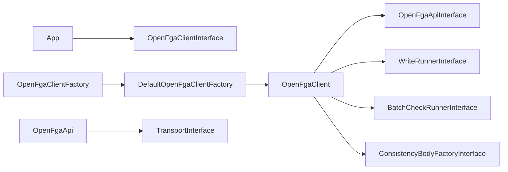

# Customization

The SDK is built from small, replaceable pieces. Depend on **interfaces** in your application; use the default classes from `OpenFgaClientFactory` unless you need different behavior.

## Architecture overview



## Replace the whole client factory

Set `clientFactory` on `ClientConfiguration`. `OpenFgaClientFactory::create()` delegates to your implementation:

```php
use Curentis\OpenFga\Client\ClientConfiguration;
use Curentis\OpenFga\Client\OpenFgaClientFactory;
use Curentis\OpenFga\Client\OpenFgaClientFactoryInterface;
use Curentis\OpenFga\Client\OpenFgaClientInterface;

final class LoggingClientFactory implements OpenFgaClientFactoryInterface
{
    public function create(
        ClientConfiguration $configuration,
        ?\Psr\Clock\ClockInterface $clock = null,
        ?\Random\Randomizer $randomizer = null,
    ): OpenFgaClientInterface {
        $inner = (new \Curentis\OpenFga\Client\DefaultOpenFgaClientFactory())->create(
            $configuration,
            $clock,
            $randomizer,
        );

        return new LoggingOpenFgaClientDecorator($inner);
    }
}

$fga = OpenFgaClientFactory::create(new ClientConfiguration(
    apiUrl: 'http://localhost:8080',
    clientFactory: new LoggingClientFactory(),
));
```

Implement `OpenFgaClientInterface` for decorators, multi-tenant routing, or metrics.

## Swap write / batch-check / consistency behavior

Implement `ClientComponentFactoryInterface` (or extend `DefaultClientComponentFactory`) and pass it as `componentFactory`:

| Method | Default | Use case |
|--------|---------|----------|
| `createWriteRunner()` | `WriteRunner` | Custom headers, metrics, alternate chunking |
| `createBatchCheckRunner()` | `BatchCheckRunner` | Different bulk request ids, validation |
| `createConsistencyBodyFactory()` | `DefaultConsistencyBodyFactory` | Custom consistency on expand/list bodies |

```php
use Curentis\OpenFga\Api\OpenFgaApiInterface;
use Curentis\OpenFga\Client\BatchCheckRunnerInterface;
use Curentis\OpenFga\Client\ClientComponentFactoryInterface;
use Curentis\OpenFga\Client\ConsistencyBodyFactoryInterface;
use Curentis\OpenFga\Client\DefaultClientComponentFactory;
use Curentis\OpenFga\Client\WriteRunnerInterface;

final class MyComponentFactory implements ClientComponentFactoryInterface
{
    public function __construct(
        private readonly DefaultClientComponentFactory $defaults = new DefaultClientComponentFactory(),
    ) {}

    public function createWriteRunner(OpenFgaApiInterface $api): WriteRunnerInterface
    {
        return new MetricsWriteRunner($this->defaults->createWriteRunner($api));
    }

    public function createBatchCheckRunner(OpenFgaApiInterface $api): BatchCheckRunnerInterface
    {
        return $this->defaults->createBatchCheckRunner($api);
    }

    public function createConsistencyBodyFactory(): ConsistencyBodyFactoryInterface
    {
        return $this->defaults->createConsistencyBodyFactory();
    }
}

$fga = OpenFgaClientFactory::create(new ClientConfiguration(
    componentFactory: new MyComponentFactory(),
));
```

Runnable sketch: [examples/custom_components.php](../examples/custom_components.php).

## HTTP and API layer

| Interface | Default class | When to override |
|-----------|---------------|------------------|
| `TransportInterface` | `Transport` | Rare; prefer `ClientConfiguration` http client and headers |
| `OpenFgaApiInterface` | `OpenFgaApi` | Mock in tests, or wrap with caching/logging |

`DefaultOpenFgaClientFactory` wires these unless you provide a custom `OpenFgaClientFactoryInterface` that builds the graph yourself.

## Testing

In unit tests, inject a mock HTTP client via `ClientConfiguration` and type-hint `OpenFgaClientInterface`. The test suite uses `Http\Mock\Client` the same way; see `tests/Support/MockTransportTestCase.php`.

For component-level tests, implement `WriteRunnerInterface` or `BatchCheckRunnerInterface` with a fake `OpenFgaApiInterface`.
