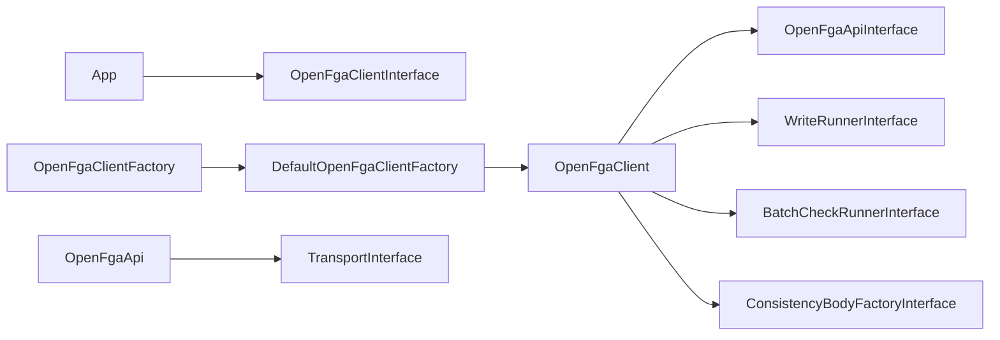

# Customization

The SDK is built from small, replaceable pieces. Depend on **interfaces** in your application; use the default classes from `OpenFgaClientFactory` unless you need different behavior.

## Architecture overview



## Replace the whole client factory

Call your factory yourself. `ClientConfiguration` holds values and the HTTP stack, not a factory, so a custom factory can safely delegate to `DefaultOpenFgaClientFactory` with the same configuration:

```php
use Curentis\OpenFga\Client\ClientConfiguration;
use Curentis\OpenFga\Client\DefaultOpenFgaClientFactory;
use Curentis\OpenFga\Client\OpenFgaClientFactoryInterface;
use Curentis\OpenFga\Client\OpenFgaClientInterface;

final class LoggingClientFactory implements OpenFgaClientFactoryInterface
{
    public function create(
        ClientConfiguration $configuration,
        ?\Psr\Clock\ClockInterface $clock = null,
        ?\Random\Randomizer $randomizer = null,
    ): OpenFgaClientInterface {
        $inner = (new DefaultOpenFgaClientFactory())->create($configuration, $clock, $randomizer);

        return new LoggingOpenFgaClientDecorator($inner);
    }
}

$fga = (new LoggingClientFactory())->create(new ClientConfiguration(
    apiUrl: 'http://localhost:8080',
));
```

Implement `OpenFgaClientInterface` for decorators, multi-tenant routing, or metrics.

## Swap write / batch-check / consistency behavior

Implement `ClientComponentFactoryInterface` (or extend `DefaultClientComponentFactory`) and pass it as `componentFactory`:

| Method | Default | Use case |
|--------|---------|----------|
| `createWriteRunner()` | `WriteRunner` | Custom headers, metrics, alternate chunking |
| `createBatchCheckRunner()` | `BatchCheckRunner` | Different bulk request ids, validation |
| `createConsistencyBodyFactory()` | `DefaultConsistencyBodyFactory` | Custom consistency on expand/list bodies |

```php
use Curentis\OpenFga\Api\OpenFgaApiInterface;
use Curentis\OpenFga\Client\BatchCheckRunnerInterface;
use Curentis\OpenFga\Client\ClientComponentFactoryInterface;
use Curentis\OpenFga\Client\ConsistencyBodyFactoryInterface;
use Curentis\OpenFga\Client\DefaultClientComponentFactory;
use Curentis\OpenFga\Client\WriteRunnerInterface;
use Curentis\OpenFga\Http\TransportInterface;

final class MyComponentFactory implements ClientComponentFactoryInterface
{
    public function __construct(
        private readonly DefaultClientComponentFactory $defaults = new DefaultClientComponentFactory(),
    ) {}

    public function createWriteRunner(OpenFgaApiInterface $api): WriteRunnerInterface
    {
        return new MetricsWriteRunner($this->defaults->createWriteRunner($api));
    }

    public function createBatchCheckRunner(OpenFgaApiInterface $api, TransportInterface $transport): BatchCheckRunnerInterface
    {
        return $this->defaults->createBatchCheckRunner($api, $transport);
    }

    public function createConsistencyBodyFactory(): ConsistencyBodyFactoryInterface
    {
        return $this->defaults->createConsistencyBodyFactory();
    }
}

$fga = OpenFgaClientFactory::create(new ClientConfiguration(
    componentFactory: new MyComponentFactory(),
));
```

Runnable sketch: [examples/custom_components.php](../examples/custom_components.php).

## HTTP and API layer

| Interface | Default class | When to override |
|-----------|---------------|------------------|
| `TransportInterface` | `Transport` | Rare; prefer `ClientConfiguration` http client and headers |
| `ParallelTransportInterface` | `Transport` | Optional capability: implement it on a custom transport to keep parallel batch checks |
| `ConcurrentSenderInterface` | `GuzzleConcurrentSender` | Send a batch of PSR-7 requests concurrently with a client other than Guzzle |
| `RetryPolicyInterface` | `RetryPolicy` | Custom backoff, or reuse it inside a replacement transport. `send()` receives a `RequestContext` (method, endpoint, route template, store id, idempotent). Implementations must be stateless: one instance is shared by every call and by the token provider |
| `OpenFgaApiInterface` | `OpenFgaApi` | Mock in tests, or wrap with caching/logging |

`ErrorMapper` is public and maps HTTP status codes onto the exception hierarchy. A replacement `Transport` is not wrapped by the default retry policy: reuse `RetryPolicy` and `ErrorMapper`, or implement that behavior yourself.

`DefaultOpenFgaClientFactory` is the composition root. Pass `uriFactory` when you replace the PSR-17 stack so URI creation stays on the same implementation as requests and streams. Pass `telemetry` (`SdkTelemetry`) for PSR-3 logs and PSR-14 events. Events are `RequestFinished` (method, endpoint, route template, store id, status code or null, attempts, `durationMs`, `RequestOutcome`), `RetryScheduled` (the same request fields plus attempt and delay), and `TokenRefreshed`. Use `route` rather than `endpoint` as a metric label: it is the path template, so it has low cardinality. Logs never include tokens, headers, or bodies. Listener and logger exceptions are swallowed.

## Testing

In unit tests, inject a mock HTTP client via `ClientConfiguration` and type-hint `OpenFgaClientInterface`. The test suite uses `Http\Mock\Client` the same way; see `tests/Support/MockTransportTestCase.php`.

For component-level tests, implement `WriteRunnerInterface` or `BatchCheckRunnerInterface` with a fake `OpenFgaApiInterface`.
